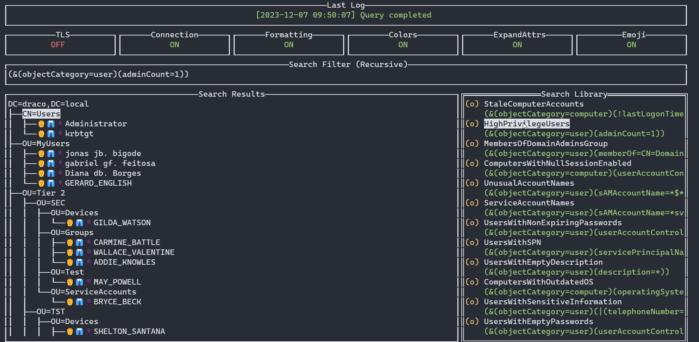
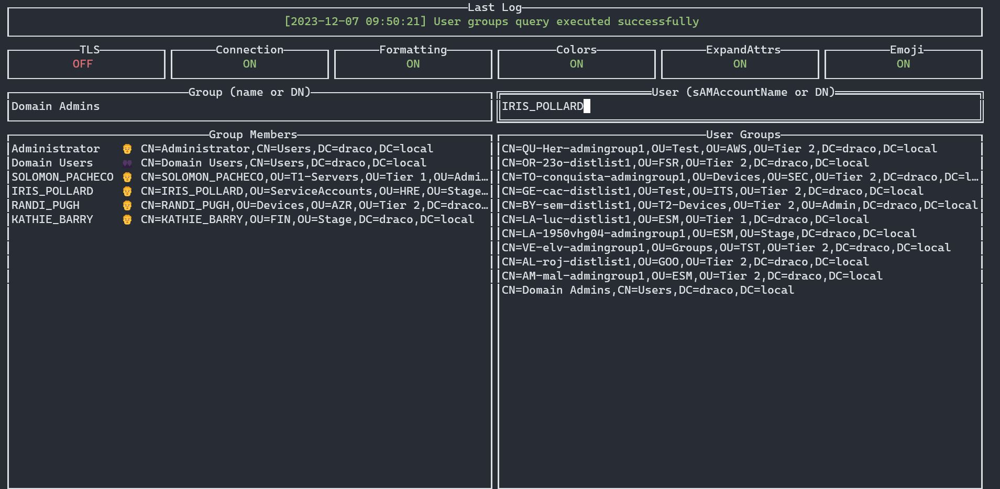
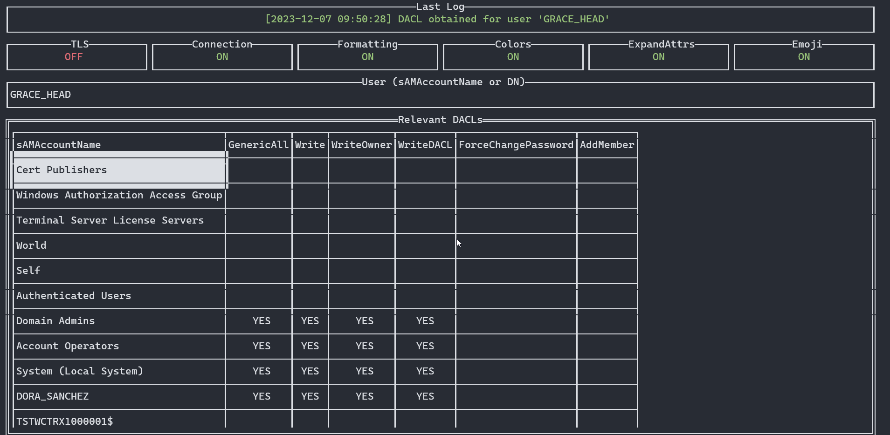

# godap

    [](https://goreportcard.com/report/github.com/Macmod/godap)

`godap` is a complete TUI for LDAP written in Golang.

# Screenshots








# Features

* Formats date/time, boolean and other categorical attributes into readable text
* Supports changing the search filter & base DN for the query
* LDAPS & StartTLS support
* Pretty colors & cool emojis
* Quick explorer that loads objects on demand
* Recursive object search bundled with useful saved searches
* Group members & user groups lookup
* Supports creation, editing and removal of objects and attributes
* Supports exporting specific subtrees of the directory into JSON files
* Interactive userAccountControl editor
* DACL viewer
* SOCKS support

# Installation

```bash
go install github.com/Macmod/godap@latest
```

# Usage

**Bind with username and password**

```bash
$ godap <hostname or IP> -u <username>@<domain> -p <password>
```

**Bind with an NTLM hash**

```bash
$ godap <hostname or IP> -u <username> -H <hash> [-d <domain>]
```

**Anonymous Bind**

```bash
$ godap <hostname or IP> -p anything
```

**LDAPS/StartTLS**

To use LDAPS for the initial connection (ignoring certificate validation) run:

```bash
$ godap <hostname or IP> [bind flags] -S -I -P 636
```

To use StartTLS to upgrade an existing connection to use TLS, use the `u` keybinding inside godap.

Notice that, if the server certificate is not trusted by your client, you must either have started godap with `-I` to use the upgrade command properly or toggle the `IgnoreCert` checkbox using the `l` keybinding before upgrading.

If LDAPS is available, you can also change the port using `l`, toggle the LDAPS checkbox, set the desired value for `IgnoreCert`, and reconnect with `r`.

**SOCKS**

To connect to LDAP through a SOCKS proxy include the flag `-x schema://ip:port`, where `schema` is one of `socks4`, `socks4a` or `socks5`.

You can also change the address of your proxy using the `l` keybinding.

Note that when using a proxy you might want to consider including the `-M` flag (enable cache) to avoid a terribly slow UI.

## Flags

* `-u`,`--username` - Username for bind
* `-p`,`--password` - Password for bind
* `-P`,`--port` - Custom port for the connection (default: `389`)
* `-r`,`--rootDN <distinguishedName>` - Initial root DN (default: automatic)
* `-f`,`--filter <search filter>` - Initial LDAP search filter (default: `(objectClass=*)`)
* `-E`,`--emojis` - Prefix objects with emojis (default: `true`, to change use `-emojis=false`)
* `-C`,`--colors` - Colorize objects (default: `true`, to change use `-colors=false`)
* `-A`,`--expand` - Expand multi-value attributes (default: `true`, to change use `-expand=false`)
* `-L`,`--limit` - Number of attribute values to render for multi-value attributes when `-expand` is `true` (default: `20`)
* `-F`,`--format` - Format attributes into human-readable values (default: `true`, to change use `-format=false`)
* `-M`,`--cache` - Keep loaded entries in memory while the program is open and don't query them again (default: `false`)
* `-I`,`--insecure` - Skip TLS verification for LDAPS/StartTLS (default: `false`)
* `-S`,`--ldaps` - Use LDAPS for initial connection (default: `false`)
* `-G`,`--paging` - Paging size for regular queries (default: `800`)
* `-d`,`--domain` - Domain for NTLM bind
* `-H`,`--hashes` - Hashes for NTLM bind
* `-x`,`--socks` - URI of SOCKS proxy to use for connection (supports `socks4://`, `socks4a://` or `socks5://` schemas)

## Keybindings

| Keybinding                        | Context                                                     | Action                                                   |
| --------------------------------- | ----------------------------------------------------------- | ------------------------------------------------------------- |
| `Ctrl` + `J`                      | Global                                                      | Next panel                                                   |
| `f` / `F`                         | Global                                                      | Toggle attribute formatting                                  |
| `e` / `E`                         | Global                                                      | Toggle emojis                                                |
| `c` / `C`                         | Global                                                      | Toggle colors                                                |
| `a` / `A`                         | Global                                                      | Toggle attribute expansion for multi-value attributes        |
| `l` / `L`                           | Global                                                      | Change current server address & credentials                  |
| `r` / `R`                           | Global                                                      | Reconnect to the server                                       |
| `u` / `U`                           | Global                                                      | Upgrade connection to use TLS (with StartTLS)                |
| `Ctrl` + `e / E`                  | Attributes panel                                             | Edit the selected attribute of the selected object           |
| `Ctrl` + `n / N` | Attributes panel                                             | Create a new attribute in the selected object                |
| `Ctrl` + `n / N` | Explorer panel                                              | Create a new object under the selected object                 |
| `Ctrl` + `s / S`  | Explorer panel                                              | Export all loaded nodes in the selected subtree into a JSON file   |
| `Ctrl` + `p / P`                  | Explorer panel                              | Change the password of the selected user or computer account  |
| `Ctrl` + `a / A`                  | Explorer panel                              | Update the userAccountControl of the object interactively |
| `Delete`                          | Explorer/attributes panel        | Deletes the selected object or attribute                      |
| `h` / `H`                               | Global                                                      | Show/hide headers                                             |
| `q`                               | Global                                                      | Exit the program                                              |

# Contributing

Contributions are welcome by [opening an issue](https://github.com/Macmod/godap/issues/new) or by [submitting a pull request](https://github.com/Macmod/godap/pulls).

# Acknowledgements

* DACL parsing code and SOCKS code were adapted from the tools below:

  * [ldapper](https://github.com/Synzack/ldapper)
  * [Darksteel](https://github.com/wjlab/Darksteel)

* [BadBlood](https://github.com/davidprowe/BadBlood) was also very useful for testing during the development of the tool.

# Disclaimer

I'm not prioritizing Kerberos authentication at the moment. Although `ldapper` (which was a great source of inspiration and useful code) supports it, the `ldapper` authors chose to rewrite lots of dependencies maintained by third parties in order to provide this feature. This does not seem like the best approach in terms of long-term support. Nonetheless, `go-ldap` (which is godap's main dependency) currently has [an open issue](https://github.com/go-ldap/ldap/issues/115) from 2017 regarding the lack of GSSAPI support. A pull request [has been merged](https://github.com/go-ldap/ldap/pull/402) in 2022 to deal with the issue on Windows platforms only, but that isn't a suitable option for this tool. I hope someone finds a solution for this issue (maybe [go-ldap/ldap/pull/449](https://github.com/go-ldap/ldap/pull/449)) that doesn't involve rewriting dependencies I won't have time to maintain :-)

# License

The MIT License (MIT)

Copyright (c) 2023 Artur Henrique Marzano Gonzaga

Permission is hereby granted, free of charge, to any person obtaining a copy of this software and associated documentation files (the "Software"), to deal in the Software without restriction, including without limitation the rights to use, copy, modify, merge, publish, distribute, sublicense, and/or sell copies of the Software, and to permit persons to whom the Software is furnished to do so, subject to the following conditions:

The above copyright notice and this permission notice shall be included in all copies or substantial portions of the Software.

THE SOFTWARE IS PROVIDED "AS IS", WITHOUT WARRANTY OF ANY KIND, EXPRESS OR IMPLIED, INCLUDING BUT NOT LIMITED TO THE WARRANTIES OF MERCHANTABILITY, FITNESS FOR A PARTICULAR PURPOSE AND NONINFRINGEMENT. IN NO EVENT SHALL THE AUTHORS OR COPYRIGHT HOLDERS BE LIABLE FOR ANY CLAIM, DAMAGES OR OTHER LIABILITY, WHETHER IN AN ACTION OF CONTRACT, TORT OR OTHERWISE, ARISING FROM, OUT OF OR IN CONNECTION WITH THE SOFTWARE OR THE USE OR OTHER DEALINGS IN THE SOFTWARE.
