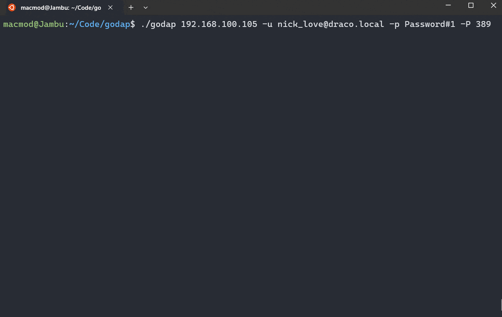

# godap

     [](https://goreportcard.com/report/github.com/Macmod/godap)  [](https://twitter.com/MacmodSec)

<h3>A complete TUI for LDAP.</h3>



# Summary

* [Features](#features)
* [Installation](#installation)
* [Usage](#usage)
   * [Flags](#flags)
   * [Keybindings](#keybindings)
* [Tree Colors](#tree-colors)
* [Contributing](#contributing)
* [Acknowledgements](#acknowledgements)
* [Disclaimers](#disclaimers)

# Features

* 🧩 Supports authentication with password, NTLM hash, Kerberos ticket or PEM/PKCS#12 certificate
* 🗒️ Formats date/time, boolean and other categorical attributes into readable text
* 😎 Pretty colors & cool emojis
* 🔐 LDAPS & StartTLS support
* ⏩ Fast explorer that loads objects on demand
* 🔎 Recursive object search bundled with useful saved searches
* 👥 Flexible group members & user groups lookups
* 🎡 Supports creation, editing and removal of objects and attributes
* 🚙 Supports moving and renaming objects
* 🗑️ Supports searching deleted & recycled objects
* 📁 Supports exporting specific subtrees of the directory into JSON files
* 🕹️ Interactive userAccountControl editor
* 🔥 Interactive DACL viewer + editor
* 🌐 Interactive ADIDNS viewer + editor (basic)
* 📜 GPO Viewer
* 🧦 SOCKS support

# Installation

```bash
$ git clone https://github.com/Macmod/godap
$ cd godap
$ go install .
```

## Package Repositories

Some members of the community have published `godap` in [package repositories](https://repology.org/project/godap/versions). The following packages are known to provide working releases of `godap`:

* *Homebrew*. [godap](https://formulae.brew.sh/formula/godap) by `harpchad`
* *Alpine Linux (community)*. [godap](https://pkgs.alpinelinux.org/package/edge/community/x86_64/godap) by `omni+alpine@hack.org`
* *Arch Linux (AUR)*. [godap-bin](https://aur.archlinux.org/packages/godap-bin) by `killab33z`

Remember to check `godap`'s version before using these packages, as some of them might not always be up to date.
In case you need the latest features, godap also provides [automated releases](https://github.com/Macmod/godap/releases) for several platforms.

# Usage

**Bind with username and password**

```bash
$ godap <hostname or IP> -u <username> -p <password> -d <domain>
```

or

```bash
$ godap <hostname or IP> -u <username>@<domain> -p <password>
```

**Bind with an NTLM hash**

```bash
$ godap <hostname or IP> -u <username> -H <hash> [-d <domain>]
```

**Bind with a Kerberos ticket**

```bash
$ KRB5CCNAME=ticket.ccache godap <hostname or IP> -k -d <domain> -t ldap/<DC hostname>
```

**Bind with a Certificate + Private Key**

PEM:
```bash
$ godap <hostname or IP> --crt <cert.pem> --key <cert.key> -I
```

PKCS#12:
```bash
$ godap <hostname or IP> --pfx <cert.pfx> -I
```

Note. This method will either pass the certificate directly when connecting with LDAPS (`-S`), or upgrade the unencrypted LDAP connection implicitly with StartTLS, therefore you must provide `-I` if you want to use it and your server certificate is not trusted by your client.

**Anonymous Bind**

```bash
$ godap <hostname or IP>
```

**LDAPS/StartTLS**

To use LDAPS for the initial connection (ignoring certificate validation) run:

```bash
$ godap <hostname or IP> [bind flags] -S -I
```

To use StartTLS to upgrade an existing connection to use TLS, use the `Ctrl + u` keybinding inside godap.

Notice that, if the server certificate is not trusted by your client, you must either have started godap with `-I` to use the upgrade command properly or toggle the `IgnoreCert` checkbox using the `l` keybinding before upgrading.

If LDAPS is available, you can also change the port using `l`, toggle the LDAPS checkbox, set the desired value for `IgnoreCert`, and reconnect with `Ctrl + r`.

**SOCKS**

To connect to LDAP through a SOCKS proxy include the flag `-x schema://ip:port`, where `schema` is one of `socks4`, `socks4a` or `socks5`.

You can also change the address of your proxy using the `l` keybinding.

For more usage information & examples check the [Wiki](https://github.com/Macmod/godap/wiki)

## Flags

* `-u`,`--username` - Username for bind
* `-p`,`--password` - Password for bind
* `--passfile` - Path to a file containing the password for bind (or `-` for stdin)
* `-P`,`--port` - Custom port for the connection (default: `389` or `636` when `-S` is provided)
* `-r`,`--rootDN <distinguishedName>` - Initial root DN (default: automatic)
* `-f`,`--filter <search filter>` - Initial LDAP search filter (default: `(objectClass=*)`)
* `-b`,`--backend` - Flavor of the LDAP server (`msad`, `basic` or `auto`)
* `-E`,`--emojis` - Prefix objects with emojis (default: `true`, to change use `-emojis=false`)
* `-C`,`--colors` - Colorize objects (default: `true`, to change use `-colors=false`)
* `-A`,`--expand` - Expand multi-value attributes (default: `true`, to change use `-expand=false`)
* `-L`,`--limit` - Number of attribute values to render for multi-value attributes when `-expand` is `true` (default: `20`)
* `-F`,`--format` - Format attributes into human-readable values (default: `true`, to change use `-format=false`)
* `-M`,`--cache` - Keep loaded entries in memory while the program is open and don't query them again (default: `true`)
* `-D`,`--deleted` - Include deleted objects in all queries performed (default: `false`)
* `-T`,`--timeout` - Timeout for LDAP connections in seconds (default: `10`)
* `-I`,`--insecure` - Skip TLS verification for LDAPS/StartTLS (default: `false`)
* `-S`,`--ldaps` - Use LDAPS for initial connection (default: `false`)
* `-G`,`--paging` - Paging size for regular queries (default: `800`)
* `-d`,`--domain` - Domain name for NTLM / Kerberos authentication
* `-H`,`--hash` - Hashes for NTLM bind
* `-k`,`--kerberos` - Use Kerberos ticket for authentication (CCACHE specified via `KRB5CCNAME` environment variable)
* `-t`,`--spn` - Target SPN to use for Kerberos bind (usually `ldap/dchostname`)
* `--hashfile` - Path to a file containing the hashes for NTLM bind (or `-` for stdin)
* `-x`,`--socks` - URI of SOCKS proxy to use for connection (supports `socks4://`, `socks4a://` or `socks5://` schemas)
* `-s`,`--schema` - Load GUIDs from schema on initialization (default: `false`)
* `--kdc` - Address of the KDC to use with Kerberos authentication (optional: only if the KDC differs from the specified LDAP server)
* `--timefmt` - Time format for LDAP timestamps. Options: eu, us, [iso8601](https://en.wikipedia.org/wiki/ISO_8601), or define your own using [go time format](https://go.dev/src/time/format.go) (default: `eu`)
* `--attrsort` - Sort attributes by name: `none` (default), `asc` (ascending), or `desc` (descending)
* `--crt` - Path to a file containing the certificate to use for the bind
* `--key` - Path to a file containing the private key to use for the bind
* `--pfx` - Path to a file containing the PKCS#12 certificate to use for the bind
* `--exportdir` - Custom directory to save godap exports taken with Ctrl+S (defaults to `data`)
* `--offset` - Custom time offset (in hours) to apply to formatted timestamps (useful when the DCs are not properly synchronized to UTC)

## Keybindings

| Keybinding                                          | Context                                                           | Action                                                                          |
| --------------------------------------------------- | ----------------------------------------------------------------- | --------------------------------------------------------------------------------|
| <kbd>Ctrl</kbd> + <kbd>Enter</kbd> (or <kbd>Ctrl</kbd> + <kbd>J</kbd>) | Global                                         | Next panel                                                                      |
| <kbd>f</kbd>                                        | Global                                                            | Toggle attribute formatting                                                     |
| <kbd>e</kbd>                                        | Global                                                            | Toggle emojis                                                                   |
| <kbd>c</kbd>                                        | Global                                                            | Toggle colors                                                                   |
| <kbd>a</kbd>                                        | Global                                                            | Toggle attribute expansion for multi-value attributes                           |
| <kbd>d</kbd>                                        | Global                                                            | Toggle "include deleted objects" flag                                           |
| <kbd>l</kbd>                                        | Global                                                            | Change current server address & credentials                                     |
| <kbd>Ctrl</kbd> + <kbd>r</kbd>                      | Global                                                            | Reconnect to the server                                                         |
| <kbd>Ctrl</kbd> + <kbd>u</kbd>                      | Global                                                            | Upgrade connection to use TLS (with StartTLS)                                   |
| <kbd>Ctrl</kbd> + <kbd>f</kbd>                      | Explorer & Search pages                                           | Open the finder to search for cached objects & attributes with regex            |
| Right Arrow                                         | Explorer panel                                                    | Expand the children of the selected object                                      |
| Left Arrow                                          | Explorer panel                                                    | Collapse the children of the selected object                                    |
| <kbd>r</kbd>                                        | Explorer panel                                                    | Reload the attributes and children of the selected object                       |
| <kbd>Ctrl</kbd> + <kbd>n</kbd>                      | Explorer panel                                                    | Create a new object under the selected object                                   |
| <kbd>Ctrl</kbd> + <kbd>s</kbd>                      | Explorer panel                                                    | Export all loaded nodes in the selected subtree into a JSON file                |
| <kbd>Ctrl</kbd> + <kbd>p</kbd>                      | Explorer panel                                                    | Change the password of the selected user or computer account (requires TLS)     |
| <kbd>Ctrl</kbd> + <kbd>a</kbd>                      | Explorer panel                                                    | Update the userAccountControl of the object interactively                       |
| <kbd>Ctrl</kbd> + <kbd>l</kbd>                      | Explorer panel                                                    | Move the selected object to another location                                    |
| <kbd>Delete</kbd>                                   | Explorer panel                                                    | Delete the selected object                                                      |
| <kbd>r</kbd>                                        | Attributes panel                                                  | Reload the attributes for the selected object                                   |
| <kbd>Ctrl</kbd> + <kbd>e</kbd>                      | Attributes panel                                                  | Edit the selected attribute of the selected object                              |
| <kbd>Ctrl</kbd> + <kbd>n</kbd>                      | Attributes panel                                                  | Create a new attribute in the selected object                                   |
| <kbd>Delete</kbd>                                   | Attributes panel                                                  | Delete the selected attribute of the selected object                            |
| <kbd>Enter</kbd>                                    | Attributes panel (entries hidden)                                 | Expand all hidden entries of an attribute                                       |
| <kbd>Delete</kbd>                                   | Groups panels                                                     | Remove the selected member from the searched group or vice-versa                |
| <kbd>Ctrl</kbd> + <kbd>s</kbd>                      | Object groups panel                                               | Export the current groups into a JSON file                                      |
| <kbd>Ctrl</kbd> + <kbd>s</kbd>                      | Group members panel                                               | Export the current group members into a JSON file                               |
| <kbd>Ctrl</kbd> + <kbd>g</kbd>                      | Groups panels / Explorer panel / Obj. Search panel                | Add a member to the selected group / add the selected object into a group       |
| <kbd>Ctrl</kbd> + <kbd>d</kbd>                      | Groups panels / Explorer panel / Obj. Search panel                | Inspect the DACL of the currently selected object                               |
| <kbd>Ctrl</kbd> + <kbd>o</kbd>                      | DACL page                                                         | Change the owner of the current security descriptor                             |
| <kbd>Ctrl</kbd> + <kbd>k</kbd>                      | DACL page                                                         | Change the control flags of the current security descriptor                     |
| <kbd>Ctrl</kbd> + <kbd>s</kbd>                      | DACL page                                                         | Export the current security descriptor into a JSON file                         |
| <kbd>Ctrl</kbd> + <kbd>n</kbd>                      | DACL entries panel                                                | Create a new ACE in the current DACL                                            |
| <kbd>Ctrl</kbd> + <kbd>e</kbd>                      | DACL entries panel                                                | Edit the selected ACE of the current DACL                                       |
| <kbd>Delete</kbd>                                   | DACL entries panel                                                | Deletes the selected ACE of the current DACL                                    |
| <kbd>Ctrl</kbd> + <kbd>s</kbd>                      | GPO page                                                          | Export the current GPOs and their links into a JSON file                        |
| <kbd>Ctrl</kbd> + <kbd>s</kbd>                      | DNS zones panel                                                   | Export the selected zones and their child DNS nodes into a JSON file            |
| <kbd>r</kbd>                                        | DNS zones panel                                                   | Reload the nodes of the selected zone / the records of the selected node        |
| <kbd>Ctrl</kbd> + <kbd>n</kbd>                      | DNS zones panel                                                   | Create a new node under the selected zone or a new zone if the root is selected |
| <kbd>Ctrl</kbd> + <kbd>e</kbd>                      | DNS zones panel                                                   | Edit the records of the currently selected node                                 |
| <kbd>Delete</kbd>                                   | DNS zones panel                                                   | Delete the selected DNS zone or DNS node                                        |
| <kbd>Delete</kbd>                                   | Records Preview (in `Update ADIDNS Node`)                         | Delete the selected record of the ADIDNS node                                   |
| <kbd>h</kbd>                                        | Global                                                            | Show/hide headers                                                               |
| <kbd>q</kbd>                                        | Global                                                            | Exit the program                                                                |

## Tree Colors

The nodes in the explorer tree are colored as follows:

| Scenario                                | Color          |
| --------------------------------------- | -------------- |
| Object exists and is enabled            | Default        |
| Object exists and is disabled           | Yellow\*       |
| Object was deleted and not yet recycled | Gray\*         |
| Object was recycled already             | Red\*          |

\* Before v2.2.0, disabled nodes were colored red. This was the only custom color in the tree panel; other nodes were colored with default colors (the "include deleted objects" flag had not been implemented yet).

# Contributing

Godap started as a fun side project, but has become a really useful tool since then. Unfortunately these days I only have limited time and there's much to be done, so if you like the tool and believe you can help please reach out to me directly at [@marzanol](https://t.me/marzanol) :-)

Contributions are also welcome by [opening an issue](https://github.com/Macmod/godap/issues/new) or by [submitting a pull request](https://github.com/Macmod/godap/pulls).

# Acknowledgements

* DACL parsing code and SOCKS code were adapted from the tools below:

  * [ldapper](https://github.com/Synzack/ldapper)
  * [Darksteel](https://github.com/wjlab/Darksteel)

* [BadBlood](https://github.com/davidprowe/BadBlood) was also very useful for testing during the development of the tool.

* Thanks [@vysecurity](https://github.com/vysecurity), [@SamErde](https://github.com/samerde) & all the others that shared the tool :)

# Disclaimers

* The main focus of this tool is Active Directory. If your target is not an Active Directory LDAP server, it's advised to set the `--backend` flag (available in versions above v2.10.4) to specify the "flavor" of your server, hiding features that aren't useful to you, and adapting others to work with your backend.

* All features were tested and seem to be working properly on a Windows Server 2019, but this tool is highly experimental and I cannot test it extensively - I don't take responsibility for modifications that you execute and end up impacting your environment. If you observe any unexpected behaviors please [let me know](https://github.com/Macmod/godap/issues/new) so I can try to fix it.

# License

The MIT License (MIT)

Copyright (c) 2023 Artur Henrique Marzano Gonzaga

Permission is hereby granted, free of charge, to any person obtaining a copy of this software and associated documentation files (the "Software"), to deal in the Software without restriction, including without limitation the rights to use, copy, modify, merge, publish, distribute, sublicense, and/or sell copies of the Software, and to permit persons to whom the Software is furnished to do so, subject to the following conditions:

The above copyright notice and this permission notice shall be included in all copies or substantial portions of the Software.

THE SOFTWARE IS PROVIDED "AS IS", WITHOUT WARRANTY OF ANY KIND, EXPRESS OR IMPLIED, INCLUDING BUT NOT LIMITED TO THE WARRANTIES OF MERCHANTABILITY, FITNESS FOR A PARTICULAR PURPOSE AND NONINFRINGEMENT. IN NO EVENT SHALL THE AUTHORS OR COPYRIGHT HOLDERS BE LIABLE FOR ANY CLAIM, DAMAGES OR OTHER LIABILITY, WHETHER IN AN ACTION OF CONTRACT, TORT OR OTHERWISE, ARISING FROM, OUT OF OR IN CONNECTION WITH THE SOFTWARE OR THE USE OR OTHER DEALINGS IN THE SOFTWARE.
